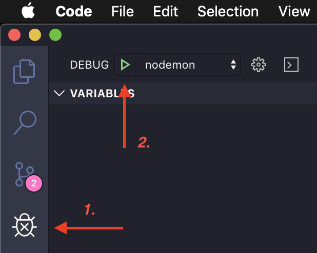

# gympoint-backend
Desafio do app "Gympoint" do curso GoStack da Rockseat

## Índice
- [Setup](#setup)
- [VSCode (Debug)](#vscode-debug)
- [Insomnia](#Insomnia)

## Setup
1. Suba um banco `postgres` e um banco `redis` (preferível com `docker`)
```bash
docker run --name database -e POSTGRES_PASSWORD=docker -p 5432:5432 -d postgres:11
docker run --name redisgympoint -p 6379:6379 -d -t redis:alpine
```

2. Crie uma database chamada `gympoint` e aponte corretamente seu nome no `.env`

3. Configure o arquivo `.env` corretamente (preenchendo as variáveis encontradas no `.env.example`)

4. Preencha o banco com uma conta de admin
```bash
yarn sequelize db:seed:all
```

5. Rode os seguintes comandos:
```bash
yarn
yarn dev

# Para iniciar fila de e-mails no redis
yarn queue
```

## VSCode (Debug)

1. Rode o seguinte comando para subir o servidor
```
yarn dev:debug
```

2. Depois inicie uma sessão de debug no vscode



## Insomnia
[Baixe aqui](https://raw.githubusercontent.com/santospatrick/gympoint-backend/master/json/Insomnia_2019-10-19.json) o arquivo .json do projeto do Insomnia para testar as requisições
